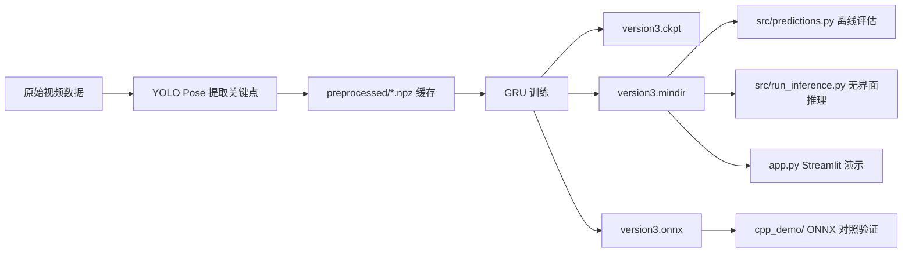

# 本地电脑研发与运行教程

## 1. 适用范围

本教程面向项目的本地研发部分，即除 `deploy/` 之外的全部内容。其目标不是把代码部署到开发板，而是在本地电脑上完成以下工作：

1. 理解项目结构与研发链路。
2. 准备数据集并完成模型训练。
3. 运行离线评估与无界面推理。
4. 启动 Streamlit 原型界面。
5. 在需要时进行 ONNX / C++ 对照验证。

## 2. 建议环境

### 2.1 操作系统

- Windows 10 / 11

### 2.2 软件组件

| 组件 | 建议 | 用途 |
| --- | --- | --- |
| Python | 3.8 及以上 | 训练、评估、原型应用 |
| Anaconda / conda | 推荐 | Python 环境隔离与包管理 |
| OpenCV | 必需 | 视频读取与处理 |
| Ultralytics | 必需 | YOLO Pose 关键点提取 |
| MindSpore | 必需 | 本地训练与 MindIR 推理 |
| Streamlit | 可选 | Web 原型界面 |
| Visual Studio Build Tools 2022 | 可选 | Windows 下编译 `cpp_demo/` |
| WSL + CMake + g++ | 可选 | Linux 路线编译 `cpp_demo/` |

### 2.3 关键说明

1. 本地 Python 主线依赖 `MindSpore`，建议优先在与当前仓库兼容的 CPU 环境下运行。
2. `yolo11n-pose.pt` 已在仓库根目录提供，本地提特征时会直接使用该权重文件。
3. 当前仓库已经清理掉早期分步实验脚本，主入口请以训练、评估、无界面推理和 Streamlit 原型为准。

## 3. 本地目录认知

| 目录 / 文件 | 角色 |
| --- | --- |
| `models/training/` | 训练与模型导出 |
| `utills/data_preprocessing.py` | 批量视频转关键点特征并缓存 |
| `utills/frame_to_keypoits.py` | 单帧姿态提取 |
| `src/predictions.py` | 离线评估 |
| `src/run_inference.py` | 无界面实时推理 |
| `src/export_video_features.py` | 导出逐帧特征 CSV |
| `src/compare_feature_csv.py` | 比较 Python / C++ 特征差异 |
| `app.py` | Streamlit 原型应用 |
| `cpp_demo/` | 本地 C++ 对照工程 |
| `artifacts/` | 本地验证输出 |
| `docs/notes/` | 研发过程笔记与汇报提纲 |

## 4. 本地研发主流程



## 5. 安装步骤

安装Anaconda可以参考这个链 [【2025版】Anaconda安装超详细教程](https://blog.csdn.net/qq_55106902/article/details/147308606?ops_request_misc=elastic_search_misc&request_id=9779b816f7c7f6921f0d7100c15fd12c&biz_id=0&utm_medium=distribute.pc_search_result.none-task-blog-2~all~top_positive~default-1-147308606-null-null.142^v102^pc_search_result_base6&utm_term=anaconda%E5%AE%89%E8%A3%85&spm=1018.2226.3001.4187)

### 5.1 使用 Anaconda 创建虚拟环境

打开Anaconda prompt：


输入下面的指令进入下载好的文件夹

```cmd
#进入D盘
D:
#输入文件夹fight-detection-system-main的路径
cd ../fight-detection-system-main
```


在这个终端依次输入下面指令

```cmd
conda create -n fight-detection python=3.10 -y
conda activate fight-detection
python -m pip install --upgrade pip
pip install -r requirements.txt
```
### 5.2 数据集准备

项目当前使用的目录组织方式如下：

```text
data/
  train/
    violence/
    non-violence/
  test/
    violence/
    non-violence/
```

推荐数据源：[`Real Life Violence and Non-Violence Data`](https://www.kaggle.com/datasets/mohamedmustafa/real-life-violence-situations-dataset)。放置完成后，再执行训练或评估脚本。

## 6. 标准运行步骤

### 6.1 训练 GRU 分类器

执行命令：

```cmd
python models/training/train_model.py
```

该步骤会完成以下动作：

1. 若 `preprocessed/` 中不存在缓存，则先调用 YOLO Pose 提取关键点。
2. 生成训练集与测试集的 `.npz` 特征缓存。
3. 训练 GRU 分类器。
4. 导出 `models/version3.ckpt` 与 `models/version3.mindir`。

特征规格：

- 每帧 153 维。
- 每段序列 41 帧。
- 输入形状为 `(41, 153)`。

### 6.2 离线评估 MindIR

执行命令：

```cmd
python src/predictions.py
```

当前脚本会优先复用以下缓存文件：

- `preprocessed/test_features_v1.npz`
- `models/training/preprocessed/test_features_v1.npz`

若缓存不存在，则会回退到重新提取测试集特征。

说明：当前 `MindIR` 评估采用单样本推理方式，这是为了兼容当前导出的图形行为，避免批量输出维度不匹配问题。

### 6.3 运行无界面推理

使用示例视频 `fn.mp4`：

```cmd
python src/run_inference.py --source-type video --video-path fn.mp4 --max-frames 60 --log-every 20 --output-video artifacts/annotated_demo.mp4 --event-log artifacts/incidents.json --summary-json artifacts/summary.json
```

无界面推理适合作为“接近部署形态”的本地验证入口。该脚本具备以下特性：

1. 支持本地视频与摄像头输入。
2. 维护 41 帧滑动窗口。
3. 支持平滑窗口与阈值控制。
4. 支持输出标注视频、事件日志与摘要 JSON。

仓库中的现有样例结果：

- `artifacts/summary.json`
- 60 帧
- 1 次事件
- 约 13.69 FPS

### 6.4 启动 Streamlit 原型界面

执行命令：

```cmd
streamlit run app.py
```

页面功能包括：

1. 摄像头 / 本地视频切换。
2. 阈值与平滑窗口调整。
3. 实时显示姿态叠加画面。
4. 事件计数与告警卡片展示。

该入口适合演示产品原型，但不建议把它视为最终部署架构。

## 7. 进阶验证

### 7.1 导出逐帧特征 CSV

```cmd
python src/export_video_features.py --video-path fn.mp4 --output-csv artifacts/fn_features.csv --max-frames 60
```

该工具用于把 Python / Ultralytics 的逐帧姿态特征导出为 CSV，便于与 C++ 版本做逐帧对齐分析。

### 7.2 比较 Python 与 C++ 特征差异

```cmd
python src/compare_feature_csv.py --reference-csv artifacts/fn_features_python_ref.csv --candidate-csv artifacts/fn_features_cpp_yolo_onnx.csv
```

该工具会输出：

1. 全局平均绝对误差。
2. 最大绝对误差。
3. 误差最大的若干帧。

### 7.3 本地 C++ 对照工程

该部分不是本地 Python 主链路的必需步骤，但对于理解部署结构、验证 ONNX 后端和对齐 C++ 推理行为非常有价值。

Windows cmd 示例：

```cmd
& 'D:/App/Microsoft Visual Studio/2022/BuildTools/Common7/IDE/CommonExtensions/Microsoft/CMake/CMake/bin/cmake.exe' -S cpp_demo -B cpp_demo/build-vs -G "Visual Studio 17 2022" -A x64 -DOpenCV_DIR="D:/App/Anaconda3/envs/pytorch/Library/cmake"
& 'D:/App/Microsoft Visual Studio/2022/BuildTools/Common7/IDE/CommonExtensions/Microsoft/CMake/CMake/bin/cmake.exe' --build cpp_demo/build-vs --config Release
```

运行示例：

```cmd
$env:PATH = 'D:/App/Anaconda3/envs/pytorch/Library/bin;D:/App/Anaconda3/envs/pytorch/Lib/site-packages/onnxruntime/capi;' + $env:PATH
.\cpp_demo\build-vs\Release\fight_detection_demo.exe --video-path .\fn.mp4 --backend onnx --model-path .\models\version3.onnx --feature-source yolo-onnx --pose-model-path .\yolo11n-pose.onnx --max-frames 45 --output-video .\artifacts\cpp_demo_onnx_pure_cpp_pose.mp4 --event-log .\artifacts\cpp_demo_onnx_pure_cpp_pose_incidents.json --summary-json .\artifacts\cpp_demo_onnx_pure_cpp_pose_summary.json
```

WSL / Ubuntu 示例：

```bash
cd cpp_demo
bash scripts/wsl_build_onnx.sh
bash scripts/wsl_run_onnx_demo.sh
```

## 8. 样例产物与建议验收点

| 验收项目 | 建议检查内容 |
| --- | --- |
| 训练完成 | `models/version3.ckpt`、`models/version3.mindir` 已生成 |
| 缓存完成 | `preprocessed/train_features_v1.npz`、`preprocessed/test_features_v1.npz` 已生成 |
| 无界面推理完成 | `artifacts/summary.json`、`artifacts/incidents.json`、`artifacts/annotated_demo.mp4` 已生成 |
| Streamlit 可用 | 页面可打开，能切换本地视频 / 摄像头 |
| C++ 对照验证完成 | `artifacts/cpp_demo_*.json` 与对应输出视频已生成 |


## 9. 与板端部署的衔接关系

本地电脑部分的主要产出包括：

1. 模型文件，例如 `version3.mindir` 与 `version3.onnx`。
2. 特征规格定义，例如 `41 x 153`。
3. Python 与 C++ 的验证方法。
4. 工程上可迁移的输入、平滑、阈值、日志与事件记录逻辑。

真正用于 Orange Pi AI Pro 的最终部署内容请继续参考 [Orange Pi AI Pro 部署教程](ORANGEPI_AI_PRO_DEPLOYMENT_GUIDE.md)。