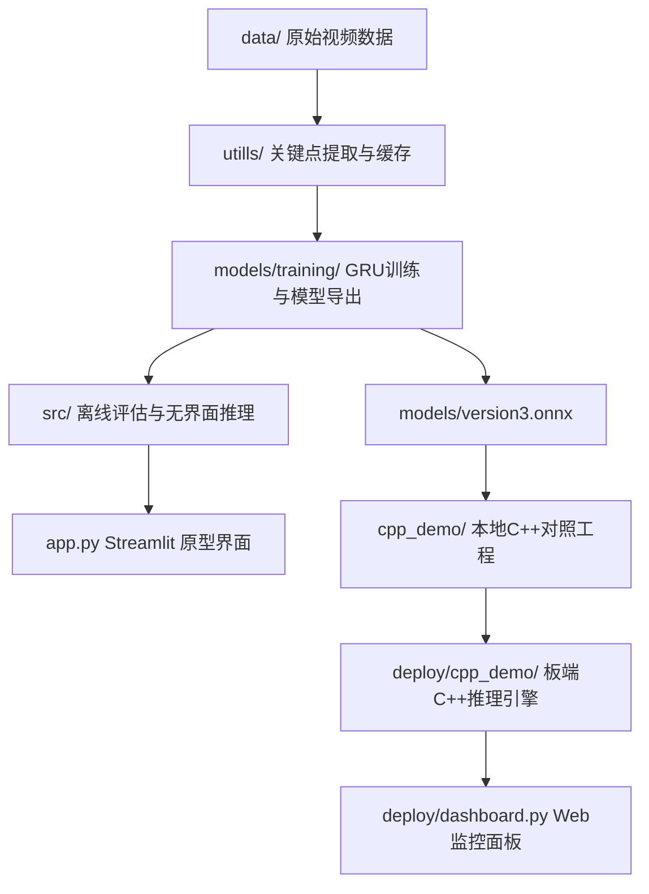
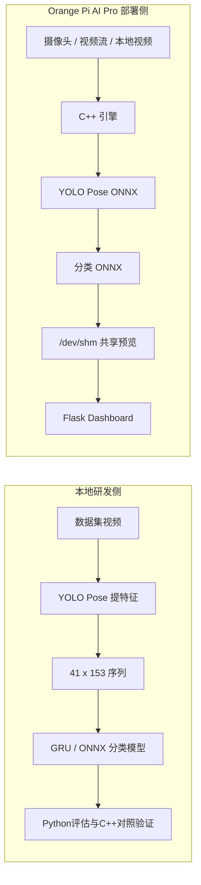

# 基于人体关键点序列的暴力行为检测系统项目说明

## 1. 文档目的

本文档用于正式说明本项目的目标、技术路线、目录分区、验证结果与当前边界条件，并作为以下两份操作文档的总入口：

- [本地电脑研发与运行教程](LOCAL_DEVELOPMENT_GUIDE.md)
- [Orange Pi AI Pro 部署教程](ORANGEPI_AI_PRO_DEPLOYMENT_GUIDE.md)

## 2. 项目定位

本项目面向“暴力 / 非暴力”视频识别任务，核心思想是先通过人体姿态估计提取时序关键点特征，再使用轻量时序分类模型进行行为判别。项目经历了从本地原型验证到板端部署落地的完整演进，当前仓库同时保留了研发过程文件与最终部署成果。

从工程视角看，该仓库可以被明确划分为两大部分：

| 部分 | 范围 | 作用 | 是否为最终交付 |
| --- | --- | --- | --- |
| 第一部分 | `deploy/` | Orange Pi AI Pro 上的最终部署成果，包含板端模型、C++ 推理工程、脚本与演示面板 | 是 |
| 第二部分 | 除 `deploy/` 外的其余目录 | 本地开发、训练、验证、模型导出、C++ 对照工程、实验记录与中间产物 | 否 |

这一区分对于撰写说明文档尤为重要，因为两部分的目标不同：第一部分强调“可运行与可部署”，第二部分强调“可研究、可复现、可迭代”。

## 3. 技术路线概述

### 3.1 核心算法链路

1. 使用 `YOLO11n-pose` 检测人体 17 个关键点。
2. 每帧最多保留 3 个人体目标，不足部分补零。
3. 每个人体目标包含 `17 x 3 = 51` 个数值，即 `x / y / confidence`。
4. 单帧特征维度固定为 `3 x 51 = 153`。
5. 单个视频窗口长度固定为 `41` 帧，最终输入张量形状为 `(41, 153)`。
6. 分类器输出暴力概率，经平滑窗口与阈值判断后生成告警结果。

### 3.2 项目演进路径

### 3.3 本地研发与板端部署的关系

## 4. 关键特征规格

| 项目 | 数值 | 说明 |
| --- | --- | --- |
| 关键点数 | 17 | 单人姿态关键点数量 |
| 最多人数量 | 3 | 每帧最多保留 3 人 |
| 单人特征维度 | 51 | `17 x (x, y, conf)` |
| 单帧特征维度 | 153 | `3 x 51` |
| 序列长度 | 41 | 固定时间窗口 |
| 推理输入形状 | `(41, 153)` | 分类器标准输入 |
| 平滑参数 | `smooth_k` | 预测概率滑动平均 |
| 告警抑制 | `cooldown` | 连续事件去重 |

## 5. 目录分层说明

### 5.1 最终部署成果

| 目录 / 文件 | 说明 |
| --- | --- |
| `deploy/` | 板端最小可部署集合 |
| `deploy/models/version3.onnx` | 板端分类模型 |
| `deploy/yolo11n-pose.onnx` | 板端姿态模型 |
| `deploy/cpp_demo/` | 板端 C++ 推理工程 |
| `deploy/install_deps_orangepi.sh` | 板端依赖安装脚本 |
| `deploy/dashboard.py` | Flask 仪表盘 |
| `deploy/SETUP.md` | 原始部署步骤说明 |
| `deploy/README_NPU.md` | NPU 演示说明 |

### 5.2 本地研发与验证材料

| 目录 / 文件 | 说明 |
| --- | --- |
| `app.py` | Streamlit 原型应用入口 |
| `src/` | 无界面推理、评估、导出与对齐工具 |
| `models/training/` | 训练、导出 MindIR / ONNX 的脚本 |
| `utills/` | 姿态提取、特征缓存与会话状态工具 |
| `cpp_demo/` | 本地 C++ 对照工程与 ONNX 验证工程 |
| `artifacts/` | 本地验证结果、JSON 摘要、CSV 与视频输出 |
| `data/` | 原始数据集目录 |
| `preprocessed/` | 关键点特征缓存 |
| `docs/notes/` | 研发过程笔记、检查清单与汇报提纲 |

## 6. 当前可运行主链路

### 6.1 本地电脑侧

- 训练入口：`models/training/train_model.py`
- 离线评估入口：`src/predictions.py`
- 无界面推理入口：`src/run_inference.py`
- Web 原型入口：`app.py`
- 本地 C++ 对照工程：`cpp_demo/`

### 6.2 Orange Pi AI Pro 侧

- 主构建与运行脚本：`deploy/cpp_demo/scripts/orangepi_build_and_run.sh`
- 环境检查脚本：`deploy/cpp_demo/scripts/check_cann_env.sh`
- Web 面板入口：`deploy/dashboard.py`
- 可选视频流模拟器：`deploy/stream_video.py`

## 7. 已验证样例结果

以下结果均来自仓库中的现有产物，适合在说明文档中作为“已验证样例”引用，但不应被误解为完整精度结论。

| 场景 | 产物文件 | 说明 | 结果摘要 |
| --- | --- | --- | --- |
| 本地 Python 无界面推理 | `artifacts/summary.json` | Python + YOLO Pose + MindIR | 60 帧，1 次事件，约 13.69 FPS |
| 本地 C++ 伪后端结构验证 | `artifacts/cpp_demo_summary.json` | 主要验证 C++ 程序结构与日志链路 | 60 帧，1 次事件，约 93.42 FPS |
| 本地 C++ ONNX + Python 导出特征 | `artifacts/cpp_demo_onnx_real_features_summary.json` | 分类后端真实 ONNX，特征由 Python 导出 | 45 帧，0 次事件，约 68.98 FPS |
| 本地纯 C++ Pose + ONNX 分类 | `artifacts/cpp_demo_onnx_pure_cpp_pose_summary.json` | 端到端 C++ 最小闭环 | 45 帧，0 次事件，约 9.71 FPS |
| 开发板 NPU 演示流 | `deploy/artifacts/cpp_demo_npu_summary.json` | Orange Pi AI Pro + 流输入 + 事件记录 | 3235 帧，9 次事件，约 11.38 FPS |

## 8. 当前边界与已知限制

1. 本地 `MindIR` 评估链路当前按单样本方式执行，原因是当前导出的图在评估脚本中不适合直接按批量维度处理。
2. 板端最终部署路线以 `ONNX Runtime + YOLO Pose ONNX + C++` 为主，而不是 MindSpore C++ Runtime。
3. `CANN EP` 需要使用带 CANN 执行提供器的 ONNX Runtime，CPU 版 ONNX Runtime 无法直接切到 `cann`。
4. 纯 C++ 姿态前处理虽然已跑通，但与 Python / Ultralytics 结果仍处于对齐阶段，因此当前应将其视为“可运行工程链路”，而不是最终精度基准。
5. 仓库内未包含现成截图或流程图图片，因此本文档优先使用 Mermaid 图、结构表与样例 JSON 结果增强可信度。

## 9. 建议补充的材料

为了进一步提升项目说明文档的展示质量，建议后续补充以下材料：

1. Orange Pi AI Pro 实机接线照片。
2. 本地 Streamlit 页面截图。
3. 板端 Flask Dashboard 截图。
4. 一段开发板实时检测演示视频或 GIF。
5. 模型训练过程曲线图，例如 loss、acc、recall、F1。

如果需要，我可以在你补充图片文件后继续把它们嵌入文档并调整版式。

## 10. 后续阅读路径

- 若你要先写项目总说明与本地复现材料，请从 [本地电脑研发与运行教程](LOCAL_DEVELOPMENT_GUIDE.md) 开始。
- 若你要整理开发板交付材料，请继续阅读 [Orange Pi AI Pro 部署教程](ORANGEPI_AI_PRO_DEPLOYMENT_GUIDE.md)。